# Urban Heat Mitigation — System Architecture

> Full-stack geospatial AI platform for urban heat stress detection, driver attribution, and cooling scenario simulation.

---

## Architecture Diagram

```mermaid
flowchart TD
    %% ── EXTERNAL SERVICES ──────────────────────────────────────────
    subgraph EXT["🌐 External Services / APIs"]
        OM["Open-Meteo API\n(Live Weather)\ntemperature · humidity · wind"]
        OSM["Overpass API\n(OpenStreetMap)\nroads · water · place nodes"]
        NOM["Nominatim / geopy\n(Geocoding & Reverse-Geocoding)\nbbox · city boundary polygon"]
    end

    %% ── DATA PIPELINE ──────────────────────────────────────────────
    subgraph PIPE["⚙️ Offline Data Pipeline  (scripts/generate_and_train.py)"]
        GP["Grid Generator\nsrc/data_collector.py\n250m × 250m spatial grid"]
        DC["Data Collector\nsrc/data_collector.py\ncollect_data()"]
        FE["Feature Engineer\nsrc/feature_engineering.py\nOne-hot LULC · interaction terms"]
        TR["Model Trainer\nsrc/model.py\ntrain_model()  XGBoost"]
        SS["Scenario Simulator\nsrc/scenario_simulator.py\nrun_all_scenarios()"]
    end

    %% ── ML MODEL / ARTIFACTS ───────────────────────────────────────
    subgraph ML["🤖 ML Artifacts (models/)"]
        XGB["XGBoost Model\nxgboost_lst.json\nLST regressor  R²=0.97"]
        MET["Model Metrics\nmetrics.json\nRMSE · MAE · R²"]
    end

    %% ── DATA STORAGE ───────────────────────────────────────────────
    subgraph DATA["🗄️ Flat-File Data Store (data/outputs/)"]
        PRED["predictions.geojson\nGrid cells + LST + HSI class\n+ top drivers per cell"]
        SHAP["shap_values.csv\nPer-cell SHAP feature attributions"]
        GIMP["global_importance.json\nGlobal mean-|SHAP| rankings"]
        STAT["city_stats.json\nCity-level aggregate statistics"]
        ZONES["zones.geojson\nVoronoi administrative zone polygons"]
        SCEN["scenarios/\nurban_greening · cool_roofs\nreflective_pavements · green_roofs\n(GeoJSON + comparison.json)"]
    end

    %% ── BACKEND ────────────────────────────────────────────────────
    subgraph BE["🐍 Backend  (FastAPI + Uvicorn  :8000)"]
        MAIN["main.py\nApp bootstrap · CORS · static serving\nstartup data loader"]

        subgraph ROUTES["API Routes"]
            RH["routes/heatmap.py\nGET /api/heatmap\nGET /api/heatmap/zones"]
            RD["routes/drivers.py\nGET /api/drivers/global\nGET /api/drivers/{cell_id}"]
            RS["routes/scenarios.py\nGET /api/scenarios/compare\nGET /api/scenarios/{name}\nPOST /api/scenarios/simulate"]
            RL["routes/locations.py\nGET /api/locations/search\nPOST /api/locations/select\nGET /api/locations/status"]
        end

        SCH["models/schemas.py\nPydantic validation schemas\nSimulationRequest · StatsResponse …"]
        BG["BackgroundTasks\n_run_pipeline()\nAsync data generation"]
    end

    %% ── FRONTEND ───────────────────────────────────────────────────
    subgraph FE_APP["⚛️ Frontend  (Next.js 15 + React 19  :3000)"]
        CTX["lib/DashboardContext.tsx\nGlobal React Context\nselectedCity · stats · layers · opacity"]
        LAY["components/DashboardLayout.tsx\nNav · city search · zone rankings\nstats cards · layer controls"]
        MAP["components/MapComponent.tsx\nLeaflet.js interactive map\nheat / NDVI / building layers\ncell click → driver panel"]
        PG1["app/page.tsx\nDashboard  (Heatmap view)"]
        PG2["app/analysis/  page\nAnalysis view"]
        PG3["app/scenarios/  page\nScenario comparison view"]
    end

    %% ── DATA FLOW ──────────────────────────────────────────────────

    %% External → Pipeline
    NOM -->|"city boundary polygon"| GP
    OM  -->|"air_temp · humidity · wind"| DC
    OSM -->|"roads · water · place nodes"| DC

    %% Pipeline internal
    GP  -->|"250m grid DataFrame"| DC
    DC  -->|"raw feature DataFrame"| FE
    FE  -->|"X, y feature matrix"| TR
    TR  -->|"trained model"| ML
    TR  -->|"trained model"| SS

    %% Pipeline → Storage
    FE  -->|"feature_matrix.csv"| DATA
    TR  -->|"SHAP values"| SHAP
    TR  -->|"global importance"| GIMP
    SS  -->|"scenario GeoJSONs"| SCEN
    DC  -->|"zones.geojson"| ZONES

    %% Backend startup loads storage
    MAIN -->|"load_data() on startup"| RH
    MAIN -->|"load_data() on startup"| RD
    MAIN -->|"load_data() on startup"| RS
    PRED -->|"read at startup"| RH
    PRED -->|"read at startup"| RD
    SHAP -->|"read at startup"| RD
    GIMP -->|"read at startup"| RD
    STAT -->|"GET /api/stats"| MAIN
    SCEN -->|"read at startup"| RS
    ZONES -->|"GET /api/zones"| MAIN

    %% Live pipeline trigger
    RL -->|"geocode query"| NOM
    RL -->|"BackgroundTask"| BG
    BG -->|"collect_data()"| DC
    BG -->|"load_model()"| XGB
    BG -->|"compute_shap()"| SHAP
    BG -->|"run_all_scenarios()"| SS
    BG -->|"reload data in memory"| RH
    BG -->|"reload data in memory"| RD
    BG -->|"reload data in memory"| RS

    %% Frontend ↔ Backend REST
    MAP  -->|"GET /api/heatmap"| RH
    MAP  -->|"GET /api/drivers/{cell_id}"| RD
    LAY  -->|"GET /api/stats"| MAIN
    LAY  -->|"GET /api/locations/search"| RL
    LAY  -->|"POST /api/locations/select"| RL
    LAY  -->|"GET /api/locations/status (polling)"| RL
    PG3  -->|"GET /api/scenarios/compare"| RS
    PG3  -->|"GET /api/scenarios/{name}"| RS
    PG3  -->|"POST /api/scenarios/simulate"| RS

    %% Context wiring
    CTX  <-->|"React Context"| LAY
    CTX  <-->|"React Context"| MAP
    CTX  <-->|"React Context"| PG1

    %% Styling
    classDef ext  fill:#1e3a5f,stroke:#4a9eff,color:#cde
    classDef pipe fill:#1a3a2a,stroke:#4caf50,color:#cfe
    classDef ml   fill:#2d1b4e,stroke:#9c6eff,color:#dce
    classDef data fill:#3a2200,stroke:#ff9800,color:#ffe
    classDef be   fill:#1a2a3a,stroke:#00bcd4,color:#cef
    classDef fe   fill:#2a1a3a,stroke:#e91e63,color:#fce

    class OM,OSM,NOM ext
    class GP,DC,FE,TR,SS pipe
    class XGB,MET ml
    class PRED,SHAP,GIMP,STAT,ZONES,SCEN data
    class MAIN,RH,RD,RS,RL,SCH,BG be
    class CTX,LAY,MAP,PG1,PG2,PG3 fe
```



---

## Component Breakdown

### 🌐 External Services

| Service | Role | Used By |
|---|---|---|
| **Open-Meteo API** | Free, no-key weather API. Returns real-time `temperature_2m`, `relative_humidity_2m`, `wind_speed_10m` for any lat/lon. | `src/data_collector.py → fetch_live_weather()` |
| **Overpass API (OSM)** | Spatial query engine on top of OpenStreetMap data. Used to extract roads, water bodies, and place/neighbourhood nodes within a bounding box. | `src/data_collector.py → fetch_osm_features()` |
| **Nominatim / geopy** | Geocoding and reverse-geocoding service. Resolves a city name → lat/lon + bounding box, and fetches the administrative boundary polygon (OSM relation). | `backend/routes/locations.py` + `src/data_collector.py → fetch_city_boundary()` |

---

### ⚙️ Offline Data Pipeline (`scripts/generate_and_train.py`)

Runs once per dataset/city to produce the pre-computed artifacts that the API serves. Also re-runs live on every new city selection.

| Module | Responsibility |
|---|---|
| **Grid Generator** (`data_collector.py`) | Tessellates the city bounding box into 250m × 250m square cells (capped at ~40×40 = 1600 cells for MVP performance). Clips cells to the city boundary polygon fetched from Nominatim. |
| **Data Collector** (`data_collector.py`) | Orchestrates OSM + Open-Meteo fetches, then calls `assign_features()` to derive NDVI, NDWI, Albedo, building density/height, Sky View Factor, LULC class, and a physics-based LST proxy for each grid cell. |
| **Feature Engineer** (`feature_engineering.py`) | One-hot encodes LULC categories (`lulc_water`, `lulc_built_up`, …) and adds two domain-specific interaction features: `ndvi × albedo` and `building_density × wind_speed`. Produces the 16-column feature matrix fed to the model. |
| **Model Trainer** (`model.py`) | Trains an **XGBoost Regressor** (200 trees, max_depth=6) on the feature matrix to predict Land Surface Temperature (LST). Saves the model as `models/xgboost_lst.json` and metrics as `models/metrics.json`. Then computes **SHAP values** via `shap.TreeExplainer` for full explainability. |
| **Scenario Simulator** (`scenario_simulator.py`) | For each of 4 cooling interventions, perturbs the relevant input features on eligible cells and re-predicts LST with the trained model. Computes `delta_T` (cooling effect) per cell. Saves per-scenario GeoJSONs and a `comparison.json` summary. |

---

### 🤖 ML Artifacts (`models/`)

| File | Description |
|---|---|
| `xgboost_lst.json` | Trained XGBoost model (~957 KB). Loaded at startup and at every new city pipeline. Achieves **R² = 0.97, RMSE = 0.90°C**. |
| `metrics.json` | Training evaluation metrics (RMSE, MAE, R², n_train, n_test). |

---

### 🗄️ Flat-File Data Store (`data/outputs/`)

There is **no database**. All runtime data is stored as flat files loaded into memory at startup.

| File | Contents |
|---|---|
| `predictions.geojson` | GeoJSON FeatureCollection. Each feature = one 250m grid cell with `cell_id`, `lst`, `predicted_lst`, `hsi_class`, `hsi_color`, all 16 input features, and the top-3 SHAP drivers. |
| `shap_values.csv` | Per-cell SHAP attribution matrix (one row per cell, one column per feature). Loaded into a Pandas DataFrame by the drivers route. |
| `global_importance.json` | Global feature importance ranked by mean absolute SHAP. Enriched with human-readable labels, categories, and heating/cooling direction. |
| `city_stats.json` | City-level aggregates: avg/max/min LST, hotspot cell count, HSI class distribution, model metrics, list of zones. |
| `zones.geojson` | Voronoi polygon tessellation of administrative zone centroids extracted from OSM `place` nodes. |
| `scenarios/*.geojson` | Per-scenario GeoJSON with `baseline_lst`, `predicted_lst`, `delta_t`, and `intervention_applied` per cell. |
| `scenarios/comparison.json` | Summary array of all 4 scenarios sorted by cooling effectiveness. |

---

### 🐍 Backend (`backend/` — FastAPI + Uvicorn, port 8000)

| Component | Endpoints / Role |
|---|---|
| **`main.py`** | App entry point. Configures CORS (wildcard for MVP), registers all routers, mounts static frontend files, defines `/api/stats`, `/api/zones`, `/api/health`, and triggers `load_data()` on startup. |
| **`routes/heatmap.py`** | `GET /api/heatmap` — returns filtered GeoJSON of the heat stress map (filter by zone, HSI class, or min LST). `GET /api/heatmap/zones` — zone summary stats. |
| **`routes/drivers.py`** | `GET /api/drivers/global` — global SHAP feature importance. `GET /api/drivers/{cell_id}` — SHAP attribution for a single grid cell, sorted by `|shap_value|`. |
| **`routes/scenarios.py`** | `GET /api/scenarios/compare` — all pre-computed scenario summaries. `GET /api/scenarios/{name}` — scenario GeoJSON (optional `applied_only` filter). `POST /api/scenarios/simulate` — custom coverage simulation (scales pre-computed results linearly). |
| **`routes/locations.py`** | `GET /api/locations/search` — geocodes any city query via Nominatim (with retry + random user-agent rotation). `POST /api/locations/select` — enqueues the full data pipeline as a `BackgroundTask`. `GET /api/locations/status` — pipeline progress (polled by frontend). |
| **`models/schemas.py`** | Pydantic v2 models: `SimulationRequest`, `ScenarioSummary`, `CellDriversResponse`, `StatsResponse`, `DriverInfo`. |

---

### ⚛️ Frontend (`frontend/` — Next.js 15 + React 19, port 3000)

| Component | Role |
|---|---|
| **`lib/DashboardContext.tsx`** | React Context providing global state: `selectedCity`, `stats`, `zoneRankings`, `selectedCell`, `isPanelOpen`, `activeLayers` (heat/NDVI/buildings toggle), `opacity`, `loading` / `loadingText`, and `driverData`. City selection is persisted to `localStorage`. |
| **`components/DashboardLayout.tsx`** | Main shell: navigation tabs, city search bar (calls `/api/locations/search` + `/api/locations/select`), pipeline progress polling, zone rankings sidebar, layer toggles, opacity slider, and stats cards. |
| **`components/MapComponent.tsx`** | Leaflet.js interactive map. Renders the heat-stress GeoJSON layer with HSI-class-based colors, optional NDVI and building-density layers, zone polygon outlines, and a click handler that fetches `/api/drivers/{cell_id}` and opens the driver attribution side-panel. |
| **`app/page.tsx`** | Dashboard route (`/`). Stat cards overlay (Avg LST, Max LST, Hotspot Cells, Total Cells + area) + `<MapComponent />`. |
| **`app/analysis/`** | Analysis view with detailed charts and breakdowns. |
| **`app/scenarios/`** | Scenario comparison page. Calls `/api/scenarios/compare` for summary cards and `/api/scenarios/{name}` / `POST /api/scenarios/simulate` for per-scenario GeoJSON. |

---

## Data Flow Summary

```
User types city name
  → Frontend calls GET /api/locations/search  (Nominatim geocode)
  → User confirms  → POST /api/locations/select
  → FastAPI enqueues BackgroundTask (_run_pipeline)
      ├─ fetch_city_boundary()       → Nominatim
      ├─ generate_grid_for_bbox()    → 250m grid
      ├─ fetch_live_weather()        → Open-Meteo API
      ├─ fetch_osm_features()        → Overpass API
      ├─ assign_features()           → physics-based feature values
      ├─ engineer_features()         → 16-column ML feature matrix
      ├─ model.predict()             → XGBoost → predicted_lst
      ├─ compute_shap_values()       → SHAP TreeExplainer
      ├─ run_all_scenarios()         → 4 × cooling intervention simulations
      └─ save all outputs to data/outputs/
  → Frontend polls GET /api/locations/status until complete
  → Map reloads GET /api/heatmap   → Leaflet renders heat layer
  → User clicks cell → GET /api/drivers/{cell_id} → SHAP panel opens
  → User views scenarios → GET /api/scenarios/compare
```

---

## Key Technology Choices

| Concern | Technology | Rationale |
|---|---|---|
| Backend framework | FastAPI + Uvicorn | Async-ready, auto-docs, Pydantic validation |
| ML model | XGBoost | State-of-the-art tabular regression, fast inference, SHAP-compatible |
| Explainability | SHAP TreeExplainer | Exact Shapley values for tree models, per-cell + global attribution |
| Geospatial | GeoPandas + Shapely | GeoJSON manipulation, grid clipping, Voronoi zones |
| Frontend framework | Next.js 15 (App Router) | SSR/CSR hybrid, file-based routing, TypeScript |
| Map rendering | Leaflet.js | Lightweight, flexible GeoJSON layer rendering |
| Data storage | Flat files (GeoJSON/CSV/JSON) | No DB dependency; suitable for MVP scale (~1600 cells) |
| Weather data | Open-Meteo | Free, no API key, real-time global coverage |
| Geospatial data | OpenStreetMap / Overpass | Open, global, rich infrastructure data |
